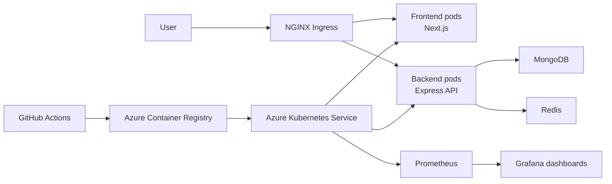

# Expensy DevOps Platform

Expensy is a cloud-native expense tracking application deployed to Azure Kubernetes Service with automated delivery, autoscaling, and live monitoring. The project turns a small full-stack app into a production-style DevOps portfolio case study: containerized services, infrastructure as code, CI/CD, Kubernetes manifests, secrets handling, and Prometheus/Grafana observability.

## Business Scenario

Imagine a consulting company that uses Expensy for employee travel reimbursements. Most days the traffic is quiet, but at the end of every month hundreds of employees upload receipts and submit reports before the finance deadline.

Without autoscaling, one backend instance would carry all of that work. Users would see slow pages, failed submissions, or timeouts right when finance needs the system most. In this deployment, Kubernetes automatically starts more identical backend copies when demand increases and spreads requests across them. When the rush is over, it scales back down so the company is not paying for unnecessary capacity.

In plain language: the platform opens more checkout lanes during a rush, then closes the extra lanes when the line disappears.

## What This Demonstrates

- Full-stack application deployment with Next.js, Express, MongoDB, and Redis.
- Dockerized frontend and backend services.
- Local development with separate frontend/backend workflows or a full Docker Compose stack.
- AKS-based Kubernetes orchestration.
- GitHub Actions CI/CD that builds, pushes, renders, and deploys application images.
- Kubernetes Horizontal Pod Autoscaler for backend and frontend workloads.
- Prometheus and Grafana monitoring through `kube-prometheus-stack`.
- Secure configuration patterns using GitHub Actions secrets and Kubernetes Secrets instead of committed credentials.
- A repeatable load test that shows backend CPU pressure, replica scaling, and load distribution in Grafana.
- Security and compliance documentation covering identity, secrets, network exposure, TLS, and monitoring retention.

## Architecture



## Application Components

| Component | Role |
| --- | --- |
| `frontend` | Next.js web UI for the expense tracker. |
| `backend` | Express API with `/api/expenses`, `/health`, and `/load` endpoints. |
| `mongo` | Stores expense data. |
| `redis` | Cache/service dependency used by the backend. |
| `ingress-nginx` | Exposes frontend and API routes over HTTPS. |
| `cert-manager` | Issues TLS certificates with Let's Encrypt. |
| `kube-prometheus-stack` | Provides Prometheus, Grafana, Alertmanager, kube-state-metrics, and node-exporter. |

## Autoscaling Demo

The backend has a CPU-based HPA:

- Minimum replicas: `1`
- Maximum replicas: `5`
- Target CPU utilization: `50%` of requested CPU

The backend includes a `/load` endpoint that performs short CPU-heavy work. For the demo, temporary BusyBox pods run inside the cluster and repeatedly call that endpoint.

```bash
KUBECONFIG=./kubeconfig kubectl run load-test-1 \
  --image=busybox:1.36 \
  --restart=Never \
  -n viktor-expensy \
  -- /bin/sh -c 'while true; do wget -q -O- http://backend:8706/load; sleep 0.3; done'

KUBECONFIG=./kubeconfig kubectl run load-test-2 \
  --image=busybox:1.36 \
  --restart=Never \
  -n viktor-expensy \
  -- /bin/sh -c 'while true; do wget -q -O- http://backend:8706/load; sleep 0.3; done'
```

Stop the test:

```bash
KUBECONFIG=./kubeconfig kubectl delete pod load-test-1 load-test-2 -n viktor-expensy --ignore-not-found
```

During a successful run, Grafana shows backend CPU rising, Kubernetes adding backend pods, and traffic spreading across the replicas. In one test run, the backend scaled to five pods with each pod using roughly `85%` to `108%` of its requested CPU, while memory remained stable. This shows the workload is CPU-bound and that scaling is being driven by real resource pressure.

## Monitoring Walkthrough

Open Grafana locally:

```bash
KUBECONFIG=./kubeconfig kubectl port-forward svc/monitoring-grafana 3000:80 -n monitoring
```

Useful dashboards:

- `Kubernetes / Compute Resources / Namespace (Pods)` for per-pod CPU, memory, and network usage.
- `Kubernetes / Compute Resources / Workload` for deployment-level behavior.
- `Kubernetes / Kubelet` for node and pod health.

For the HPA presentation, filter the namespace to:

```text
viktor-expensy
```

What to point out:

- Before the test, the backend runs as one pod.
- The load-test pods call `/load` and create backend CPU pressure.
- CPU rises above the HPA target.
- Kubernetes increases backend replicas.
- Requests are spread across the new backend pods.
- When the test stops, CPU drops and Kubernetes scales the backend back down after a short stabilization window.

## CI/CD

The GitHub Actions workflow in `.github/workflows/deploy.yml`:

1. Checks out the repository.
2. Builds the backend and frontend.
3. Logs in to Azure Container Registry.
4. Builds and pushes versioned Docker images.
5. Renders Kubernetes manifests with the current image tag and domain settings.
6. Creates the Kubernetes app secret from GitHub Actions secrets.
7. Deploys to AKS and waits for backend/frontend rollouts.

Required GitHub repository secrets:

| Secret | Purpose |
| --- | --- |
| `ACR_USERNAME` | Azure Container Registry username. |
| `ACR_PASSWORD` | Azure Container Registry password. |
| `KUBE_CONFIG` | AKS kubeconfig content for deployment. |
| `APP_DOMAIN` | Public ingress hostname. |
| `CERT_MANAGER_EMAIL` | Email used for Let's Encrypt registration. |
| `MONGO_INITDB_ROOT_USERNAME` | MongoDB root username. |
| `MONGO_INITDB_ROOT_PASSWORD` | MongoDB root password. |
| `REDIS_PASSWORD` | Redis password used by Redis and backend. |

## Security Notes

This repository intentionally excludes local credentials and generated cloud state:

- Local `.env` files are ignored.
- Local `kubeconfig` files are ignored.
- Kubernetes Secret manifests such as `k8s/secret.yaml` are ignored.
- Terraform state files are ignored.
- Example files are provided instead, such as `backend/.env.example` and `k8s/secret.example.yaml`.

The deployment flow creates real Kubernetes Secrets from GitHub Actions secrets at runtime. This keeps sensitive values out of source control while still allowing automated deployments.

See [`SECURITY.md`](SECURITY.md) for the security overview, compliance notes, and production hardening backlog.

## Repository Guide

| Path | Description |
| --- | --- |
| `frontend/` | Next.js frontend. |
| `backend/` | Express backend API. |
| `k8s/` | Kubernetes manifests, HPA, ingress, cert-manager issuer, and monitoring values. |
| `terraform/aks/` | AKS infrastructure configuration. |
| `.github/workflows/deploy.yml` | CI/CD pipeline for build and deployment. |
| `SECURITY.md` | Security controls, compliance notes, and production hardening backlog. |
| `docker-compose.yml` | Local development support. |

## Prerequisites

For local development:

- Node.js 20 or newer.
- npm.
- Docker and Docker Compose.

For cloud deployment:

- Azure CLI.
- kubectl.
- Helm.
- An Azure subscription.
- Azure Container Registry.
- Azure Kubernetes Service.
- A domain or cloud DNS name for ingress.

## Local Development

The app can be run in two ways: directly with npm for active frontend/backend development, or with Docker Compose to run the full stack in containers.

### Environment Files

Create local environment files from examples. These files are intentionally ignored by git.

```bash
cp backend/.env.example backend/.env
cp frontend/.env.example frontend/.env.local
```

For local Docker Compose, the compose file already provides development defaults for MongoDB and Redis. For direct npm development, make sure `backend/.env` points to reachable MongoDB and Redis instances.

### Backend

Install dependencies and start the Express API:

```bash
cd backend
npm install
npm run dev
```

The backend runs on:

```text
http://localhost:8706
```

Useful endpoints:

| Endpoint | Purpose |
| --- | --- |
| `GET /health` | Health check used by Kubernetes probes. |
| `GET /api/expenses` | List expenses. |
| `POST /api/expenses` | Create an expense. |
| `GET /load` | CPU-bound endpoint used for autoscaling demos. |

### Frontend

Install dependencies and start the Next.js UI:

```bash
cd frontend
npm install
npm run dev
```

The frontend runs on:

```text
http://localhost:3000
```

Set `NEXT_PUBLIC_API_URL` in `frontend/.env.local` if the backend is not running on the default local URL.

## Container Usage

Run the complete local stack with Docker Compose:

```bash
docker compose up --build
```

This starts:

- Backend on `http://localhost:8706`
- Frontend on `http://localhost:3000`
- MongoDB on port `27017`
- Redis on port `6379`

Stop the stack:

```bash
docker compose down
```

Remove local database/cache volumes when you want a clean reset:

```bash
docker compose down -v
```

Build individual images:

```bash
docker build -t expensy-backend ./backend
docker build -t expensy-frontend ./frontend
```

## Kubernetes Deployment

The cloud target for this project is Azure Kubernetes Service. Detailed AKS, ingress, cert-manager, monitoring, and demo commands are documented in [`k8s/README.md`](k8s/README.md).

### 1. Provision AKS Infrastructure

Terraform configuration is stored in `terraform/aks/`.

```bash
cd terraform/aks
terraform init
terraform plan
terraform apply
```

The exact variable values depend on your Azure subscription, resource group, region, cluster name, and container registry naming.

### 2. Build And Publish Images

The preferred path is GitHub Actions, which builds and pushes images automatically. For a manual deployment, build and push images to Azure Container Registry:

```bash
az acr login --name <acr-name>

docker build -t <acr-login-server>/viktor-expensy-backend:latest ./backend
docker build -t <acr-login-server>/viktor-expensy-frontend:latest ./frontend

docker push <acr-login-server>/viktor-expensy-backend:latest
docker push <acr-login-server>/viktor-expensy-frontend:latest
```

Make sure AKS can pull from ACR:

```bash
az aks update \
  --resource-group <resource-group> \
  --name <aks-cluster> \
  --attach-acr <acr-name>
```

### 3. Configure Secrets

Create a local Kubernetes Secret manifest from the example file:

```bash
cp k8s/secret.example.yaml k8s/secret.yaml
```

Replace every `change-me` value in `k8s/secret.yaml`. The real `secret.yaml` file is ignored by git and should not be committed.

### 4. Apply Kubernetes Manifests

High-level flow:

```bash
kubectl apply -f k8s/namespace.yaml
kubectl apply -f k8s/configmap.yaml
kubectl apply -f k8s/secret.yaml
kubectl apply -f k8s/mongo.yaml
kubectl apply -f k8s/redis.yaml
kubectl apply -f k8s/backend.yaml
kubectl apply -f k8s/frontend.yaml
kubectl apply -f k8s/ingress.yaml
kubectl apply -f k8s/cluster-issuer.yaml
kubectl apply -f k8s/hpa.yaml
```

For production-like deployments, prefer the GitHub Actions workflow so image tags and secrets are handled consistently.

### 5. Install Supporting Cluster Services

Install ingress and cert-manager:

```bash
helm repo add ingress-nginx https://kubernetes.github.io/ingress-nginx
helm repo add jetstack https://charts.jetstack.io
helm repo update

helm upgrade --install ingress-nginx ingress-nginx/ingress-nginx \
  --namespace ingress-nginx \
  --create-namespace

helm upgrade --install cert-manager jetstack/cert-manager \
  --namespace cert-manager \
  --create-namespace \
  --set crds.enabled=true
```

Install monitoring:

```bash
helm repo add prometheus-community https://prometheus-community.github.io/helm-charts
helm repo update

helm upgrade --install monitoring prometheus-community/kube-prometheus-stack \
  --namespace monitoring \
  --create-namespace \
  --values k8s/monitoring-values.yaml
```

## Troubleshooting

### Grafana Port-Forward Drops

If port-forwarding to Grafana disconnects and the pod shows `OOMKilled`, increase Grafana memory in `k8s/monitoring-values.yaml` and reapply the Helm release:

```bash
helm upgrade --install monitoring prometheus-community/kube-prometheus-stack \
  --namespace monitoring \
  --create-namespace \
  --values k8s/monitoring-values.yaml
```

### Backend Fails After Secret Rotation

Kubernetes environment variables from Secrets are read when a pod starts. After rotating Redis or MongoDB credentials, restart the affected workloads:

```bash
kubectl rollout restart deployment/redis -n viktor-expensy
kubectl rollout restart deployment/mongo -n viktor-expensy
kubectl rollout restart deployment/backend -n viktor-expensy
```

For MongoDB, `MONGO_INITDB_ROOT_PASSWORD` only initializes the root user on first database creation. In a lab environment without persistent volumes, deleting the Mongo pod resets the data. With persistent volumes, update the Mongo user password inside MongoDB or recreate the volume intentionally.

### HPA Does Not Scale

Check that metrics are available:

```bash
kubectl top pods -n viktor-expensy
kubectl get hpa -n viktor-expensy
```

If metrics are unavailable, install or repair metrics-server.

### Load Test Pods Keep Running

Stop all temporary load pods:

```bash
kubectl delete pod load-test-1 load-test-2 load-test-3 load-test-4 -n viktor-expensy --ignore-not-found
```
